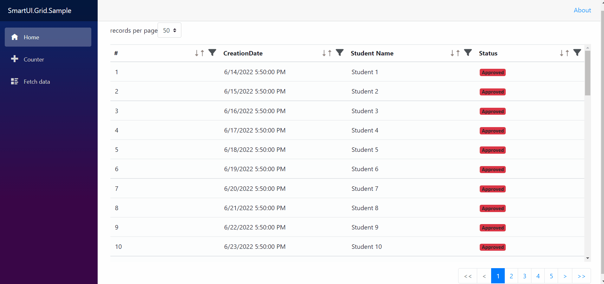

# <h1 align="center">SmartGrid</h1>

<h4 align="center">The light weight DataTable created with Blazor and support Filter, Sort, Pagination and more Features.</h4>

<p align="center">
  <a href="#key-features">Demo</a> •
  <a href="#key-features">Key Features</a> •
  <a href="#key-features">Important Notice</a> •
  <a href="#how-to-use">Installation</a> •
  <a href="#how-to-use">How To Use</a> •
  <a href="#you-may-also-like">You may also like</a> •
  <a href="#license">License</a>
</p>

## Demo
SmartGrid component as a service for [Blazor](https://blazor.net)!



## Key Features

* Filteration
  - There are 8 ObjectFilters that used to filter your DataSource.
* Sorting
  - Support For sorting your DataSource by indvidual Column or list of columns. 
* Pagination
  - Perform pagination code to paginate your owen source data as well to optimization.
* Support Server-Side Data Manipulation.
* Header and Row Customization.
  - You can customize row and header for spacific column by using <span>\<HeaderTemplate\></span> and <span>\<RowTemplate\></span>
  
## Important Notice
This project is still under active development! Currently an alpha version is available on NuGet, but keep in mind that a later version might contain breaking changes. 

```
### Planned work: 
- [] Code cleanup
- [] Better documentation
```

### Installation
1. Install the [NuGet](https://www.nuget.org/packages/SmartUI.Grid/) package:

   ```
   > dotnet add package SmartUI.Grid
   
   OR
   
   PM> Install-Package SmartUI.Grid
   ```
   Use the `--version` option to specify a specific version to install.

   Or use the build in NuGet package manager of your favorite IDEA. Simply search for `SmartUI.Grid`, select a version and hit install.

2. Import the components:

   Add the following using statement `@using SmartUI.Grid` to one of the following: 
   - For global import add it to your  `_Imports.razor` file.
   - For a scoped import add  it to your desired Blazor component.
  
   Add The following code to Program.cs or to StartUp.cs to register required services in Depandancy Injection container.
  
   ```cs
    builder.Services.AddSmartGrid(); // Program.cs

    OR

    Services.AddSmartGrid(); // StartUp.cs
   ```
3. Reference css style file:
   
    Add `<link href="_content/SmartUI.Grid/smartGrid.css"` to your _Host.cshtml or your index.html

## How To Use

```cs            
<SmartGrid TSource="Student" DataSource="students" AllowFilter="true" AllowSorting="true" AllowPagination="true">
    <GridColumns>
        <GridColumn PropertyName="Id" Title="#" AllowFilter="false" />
        <GridColumn PropertyName="CreationDate" />
        <GridColumn PropertyName="Name" Title="Student Name" />
        <GridColumn PropertyName="Status">
            <RowTemplate>
                <span class="badge bg-danger">@(((Student)context).Status)</span>
            </RowTemplate>
        </GridColumn>
    </GridColumns>
</SmartGrid>

@code {
    private IEnumerable<Student> students;
    public class Student
    {
        public int Id { get; set; }
        public DateTime CreationDate { get; set; }
        public string Name { get; set; }
        public string Status { get; set; }
    }

    protected override void OnInitialized()
    {
        students = Enumerable.Range(1, 1000).Select(e => new Student
            {
                Id = e,
                CreationDate = DateTime.Now.AddDays(e),
                Name = $"Student {e}",
                Status = "Approved"
            });
    }
}
```

## License
This project is licensed under the MIT License - see the [LICENSE](LICENSE) file for details
